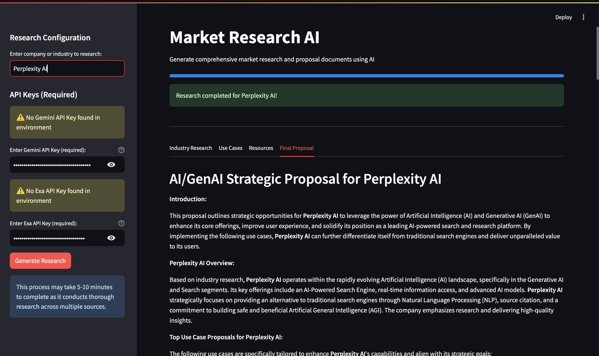
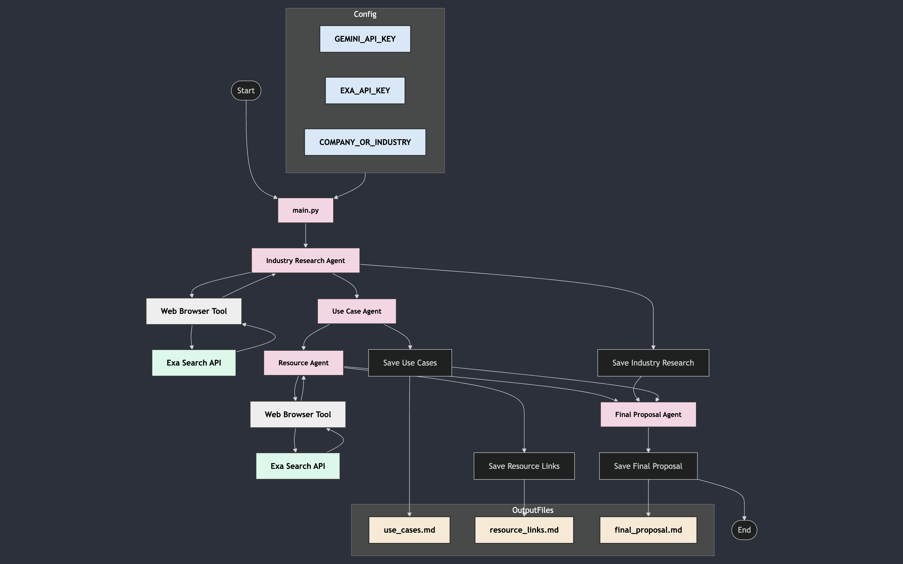

# AI-Powered Market Research and Proposal Generation

- ### [Demo Video](https://drive.google.com/file/d/1T4VASEsHrqYaLdABuf5HuEFNpaX6WT2p/view?usp=sharing)
- ### [Project Report](https://github.com/Jai0401/market-research-catalyst/blob/main/project-report.md)

## 1. Project Overview

### Description
This project automates the process of market research, use case generation, resource discovery, and final proposal creation using a multi-agent system powered by Large Language Models (LLMs) and Generative AI (GenAI). It leverages the Gemini API and a web browser tool to gather information, generate ideas, and create a comprehensive proposal document.

### Purpose
The primary goal is to streamline the market research and proposal generation process, making it faster and more efficient.

### Key Features
*   Automated market research using a web browser tool.
*   AI-powered use case generation.
*   Resource discovery for relevant datasets and articles.
*   Final proposal generation summarizing research, use cases, and resources.

### Target Audience
This project is intended for business analysts, consultants, and anyone who needs to quickly generate market research reports and proposals.

## 2. Getting Started

### Prerequisites
*   Python 3.6 or higher
*   A Gemini API key
*   An Exa API key

### Installation
1.  **Clone the repository:**
    ```bash
    git clone https://github.com/Jai0401/market-research-catalyst.git
    cd market-research-catalyst
    ```
    
2.  **Create a virtual environment (recommended):**
    ```bash
    python -m venv venv
    source venv/bin/activate  # On Linux/macOS
    venv\Scripts\activate  # On Windows
    ```
3.  **Install dependencies:**
    ```bash
    pip install -r requirements.txt
    
### Configuration
1.  **Set up environment variables:**
    *   Create a `.env` file in the project root directory.
    *   Add your Gemini API key and Exa API key to the `.env` file:
    ```bash
    GEMINI_API_KEY=<your_gemini_api_key>
    EXA_API_KEY=<your_exa_api_key>
    ```
    
2.  **Configure the industry to research:**
    *   Open the `config.py` file.
    *   Modify the `COMPANY_OR_INDUSTRY_TO_RESEARCH` variable to the desired industry or company:
    ```python
    COMPANY_OR_INDUSTRY_TO_RESEARCH = "Agriculture"  # Example: "Healthcare"
    ```
    
### First-Time Run
1.  **Run the `main.py` script:**
    ```bash
    python3 main.py
    ```
 This will execute the multi-agent system, performing market research, generating use cases, collecting resources, and creating the final proposal. The outputs will be saved in the `output` directory.

## 3. Core Modules and Architecture


### Components
*   **`agents/industry_research_agent.py`:** Researches industry information using a web browser tool.
*   **`agents/use_case_agent.py`:** Generates relevant AI/GenAI use cases based on industry research.
*   **`agents/resource_agent.py`:** Collects relevant datasets and resources for the generated use cases.
*   **`agents/final_proposal_agent.py`:** Creates the final proposal, summarizing use cases and resources.
*   **`tools/web_browser.py`:** A tool for browsing the web and retrieving information.
*   **`config.py`:** Configuration file for API keys and other settings.
*   **`main.py`:** Orchestrates the multi-agent system.

### Relationships
The `main.py` script orchestrates the agents in a sequential manner. The output of one agent serves as the input for the next.  The `industry_research_agent`'s output feeds into the `use_case_agent`, which in turn feeds into the `resource_agent`. Finally, all three outputs are used by the `final_proposal_agent`.

### Key Functionalities
*   **Industry Research Agent:** Uses the `WebBrowserTool` to gather information about a specified industry or company.
*   **Use Case Agent:** Leverages the Gemini API to generate AI/GenAI use cases based on the industry research.
*   **Resource Agent:** Finds relevant datasets and resources using the `WebBrowserTool` for the generated use cases.
*   **Final Proposal Agent:** Synthesizes a final proposal document from the industry research, use cases, and resources.
*   **Web Browser Tool:** Provides web browsing capabilities to the agents.

## 4. Usage Examples

### Common Use Cases
*   Generating a market research report for a specific industry.
*   Identifying potential AI/GenAI use cases for a company.
*   Creating a proposal for implementing AI solutions in a particular sector.

### Best Practices
*   Ensure that the Gemini and Exa API keys are correctly configured in the `.env` file.
*   Experiment with different values for `COMPANY_OR_INDUSTRY_TO_RESEARCH` in `config.py` to explore different industries.

## 5. Dependencies

### Libraries and Tools
*   `langchain==0.3.19`
*   `langchain-google-genai==2.0.11`
*   `exa_py==1.8.9`
*   `python-dotenv==1.0.1`
*   `google-generativeai==0.8.4`
*   See `requirements.txt` for a complete list.

### System Prerequisites
*   Python 3.6+

### External Services
*   Gemini API
*   Exa API

## 6. Future Improvements and Roadmap

### Planned Enhancements
*   Implement asynchronous operations for improved performance.
*   Add more sophisticated prompt engineering techniques.
*   Incorporate a validation process with industry experts.

### Optimization Opportunities
*   Fine-tune the prompts for each agent to improve the quality of the generated content.
*   Explore different LLMs and web search tools.

### Known Limitations
*   The system's functionality is dependent on valid API keys for Gemini and Exa services.
*   The quality of the output is inherently tied to the capabilities of the LLMs and the effectiveness of the prompts used for each agent.
```
