## AI-Powered Market Research and Proposal Generation Report

### 1. Introduction

This report details a methodology, results, and conclusions derived from an AI-powered system designed for automated market research and proposal generation. The system leverages a multi-agent architecture, employing Large Language Models (LLMs) and Generative AI (GenAI) to streamline the process of industry analysis, use case identification, resource discovery, and final proposal creation. The architecture flowchart of the implementation is presented to visually represent the system's workflow.

### 2. Methodology

The core methodology of this project is based on a multi-agent system, where each agent is specialized in a specific task within the market research and proposal generation pipeline. The system is orchestrated by the `main.py` script and configured through `config.py`, utilizing API keys for Gemini (LLM) and Exa (Web Search). The overall workflow is sequential, with the output of one agent serving as input for the next.

**2.1 System Architecture**

The system architecture is depicted in the flowchart below:

As shown in the flowchart, the system operates through the following stages:

1.  **Configuration (Config):** The process starts with loading configurations from `config.py`, which includes API keys for Gemini and Exa services, and the target industry or company for research (`COMPANY_OR_INDUSTRY_TO_RESEARCH`).
2.  **Industry Research Agent:** Initiated by `main.py`, this agent uses the `Web Browser Tool` powered by the Exa Search API to conduct market research on the specified industry. The agent's goal is to understand the industry landscape, key trends, and strategic focus areas. The output is saved as "Save Industry Research" data.
3.  **Use Case Agent:**  This agent takes the "Save Industry Research" data as input and leverages the Gemini API to generate relevant AI and GenAI use cases for the target industry. It focuses on practical and impactful applications that can improve processes, enhance customer satisfaction, and boost operational efficiency. The generated use cases are saved as "Save Use Cases" data and also outputted to `use_cases.md`.
4.  **Resource Agent:** Utilizing the "Save Use Cases" data and the `Web Browser Tool` with Exa Search API, this agent identifies and collects relevant datasets, articles, and open-source projects that can support the implementation of the generated use cases. The discovered resource links are saved as "Save Resource Links" data and outputted to `resource_links.md`.
5.  **Final Proposal Agent:** This agent consolidates the "Save Industry Research," "Save Use Cases," and "Save Resource Links" data. It employs the Gemini API to synthesize a comprehensive final proposal document. This proposal summarizes the industry research, highlights the top use cases, and provides relevant resource assets. The final proposal is saved as "Save Final Proposal" data and outputted to `final_proposal.md`.
6.  **Output Files:** The system generates three primary output files in the `output` directory: `use_cases.md`, `resource_links.md`, and `final_proposal.md`, which contain the generated use cases, resource links, and the final proposal, respectively.

**2.2 Agent Details**

*   **Industry Research Agent (`agents/industry_research_agent.py`):**  This agent is designed to act as a market research expert. It uses the `WebBrowserTool` to search the web for information about a given industry or company. The prompt instructs the agent to identify industry segments, key offerings, and strategic focus areas. It uses a `ZERO_SHOT_REACT_DESCRIPTION` agent type, allowing it to use tools based on descriptions.
*   **Use Case Agent (`agents/use_case_agent.py`):** This agent acts as an AI and GenAI use case generation expert. It takes the industry research output as input and proposes relevant use cases for leveraging GenAI, LLMs, and ML technologies. The prompt emphasizes practical and impactful use cases focusing on operations enhancement, customer experience improvement, automation, and new opportunities. It utilizes a simple `LLMChain` as no external tools are needed.
*   **Resource Agent (`agents/resource_agent.py`):** This agent functions as a resource finding expert, specializing in datasets and AI/ML resources. It uses the `WebBrowserTool` to search for datasets (e.g., on Kaggle, HuggingFace Datasets) and other relevant resources (articles, blog posts, GitHub projects) for the generated use cases. It also employs a `ZERO_SHOT_REACT_DESCRIPTION` agent type to utilize the web browser tool.
*   **Final Proposal Agent (`agents/final_proposal_agent.py`):** This agent serves as a final proposal generation expert. It summarizes the industry research, generated use cases, and collected resource links to create a structured final proposal document. The prompt guides the agent to summarize top use cases, ensure relevance, add references, and format the output as a clear and concise proposal. It uses a simple `LLMChain` as no external tools are needed.

**2.3 Tools**

*   **Web Browser Tool (`tools/web_browser.py`):** This tool, based on the `exa-py` library, enables the agents to browse the web and retrieve information. It is used by the Industry Research Agent and Resource Agent to gather data and resources from the internet.

**2.4 Configuration and Execution**

The system is configured via `config.py`, where the `COMPANY_OR_INDUSTRY_TO_RESEARCH` variable is set to "Agriculture" for this run. API keys for Gemini and Exa are loaded from a `.env` file for security. The `main.py` script executes the agents sequentially, passing outputs from one agent to the next. The final outputs are saved as markdown files in the `output` directory.

### 3. Results

The system was executed with the target industry set to "Agriculture". The key outputs generated by the system are summarized below:

**3.1 Industry Research Output (Implicitly Saved)**

The Industry Research Agent successfully performed web research on the Agriculture industry. The research output, while not explicitly saved to a separate file, is passed to the subsequent agents. Based on the final proposal, the research covered:

*   Industry segments and strategic focus areas within agriculture.
*   Key trends and challenges in the agriculture sector.

**3.2 Use Case Generation Output (`output/use_cases.md`)**

The Use Case Agent generated five relevant AI/GenAI use cases for the agriculture industry, focusing on practical and impactful applications:

1.  **AI-Powered Crop Disease and Pest Detection & Diagnosis:**  Using image recognition and LLMs for early detection and diagnosis of crop diseases and pests.
2.  **Personalized Agricultural Advice and Support Chatbot:** Developing an LLM-based chatbot to provide farmers with personalized advice on various agricultural practices.
3.  **Automated Supply Chain Optimization and Demand Forecasting:** Optimizing the agricultural supply chain using ML for demand forecasting, logistics, and anomaly detection.
4.  **GenAI-Powered Content Creation for Agricultural Marketing and Education:** Generating marketing and educational content using GenAI for the agriculture sector.
5.  **Automated Quality Control in Food Processing:** Automating quality control processes in food processing plants using image recognition and sensor data analysis.

**3.3 Resource Asset Collection Output (`output/resource_links.md`)**

The Resource Agent collected relevant dataset and resource links for each of the generated use cases. The `resource_links.md` file provides a list of clickable links, including:

*   Datasets from platforms like Kaggle, UCI Machine Learning Repository, and Mendeley Data.
*   GitHub repositories related to crop recommendation, predictive maintenance, and plant disease detection.
*   Articles and resources related to AI in agriculture and smart agriculture solutions.

**3.4 Final Proposal Output (`output/final_proposal.md`)**

The Final Proposal Agent synthesized a comprehensive proposal document, `final_proposal.md`, structured as follows:

*   **Introduction:** Briefly introduces the proposal's purpose: leveraging GenAI and ML for the agriculture industry.
*   **Industry Overview:** Summarizes key findings from the industry research, highlighting strategic focus areas like increasing productivity, promoting sustainability, and embracing technological innovation.
*   **Top Use Case Proposals (4 Selected):** Details four of the top use cases (selected from the five generated), including:
    1.  Personalized Crop Management Recommendations
    2.  Automated Pest and Disease Detection & Diagnosis
    3.  Predictive Maintenance for Farm Machinery
    4.  Enhanced Customer Support and Training
    For each use case, the proposal includes a description, explanation of GenAI/ML application, potential benefits, and implementation strategies.
*   **Resource Assets:** Lists relevant dataset and resource links for each of the top use cases, directly linking to resources mentioned in `resource_links.md`.
*   **Conclusion:** Summarizes the value proposition and next steps, suggesting feasibility studies, pilot programs, funding, and partnerships.

### 4. Conclusions

The AI-powered market research and proposal generation system successfully automated the end-to-end process for the agriculture industry. The multi-agent architecture effectively decomposed the complex task into manageable stages, with each agent contributing specialized expertise.

**Key Findings and Observations:**

*   **Effective Automation:** The system demonstrates the potential of AI and multi-agent systems to automate complex, knowledge-intensive tasks like market research and proposal creation.
*   **Relevant and Actionable Outputs:** The generated use cases are highly relevant to the agriculture industry and offer practical applications of GenAI and ML technologies. The resource links provide valuable starting points for further exploration and implementation.
*   **Structured and Comprehensive Proposal:** The final proposal document is well-structured, informative, and provides a solid foundation for decision-making and further action.
*   **Scalability and Adaptability:** The system can be easily adapted to research other industries or companies by modifying the `COMPANY_OR_INDUSTRY_TO_RESEARCH` variable in `config.py`. The modular agent design allows for potential expansion and customization of the system.
*   **Integration of Tools and APIs:** The seamless integration of LLMs (Gemini API) and web search tools (Exa API) demonstrates the power of combining different AI capabilities to achieve complex objectives.

**Overall, this project provides a valuable framework for automating market research and proposal generation. The generated outputs and the system's architecture offer a strong starting point for organizations looking to leverage AI to streamline their strategic planning and innovation processes.**
